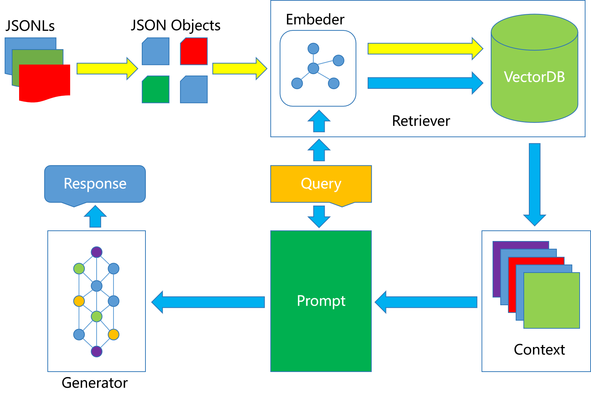

# 1 Naive RAG

Naive RAG 的简单实现。

<div align="center">图 1 Naive RAG 架构图</div>

# 2 使用指南

## 2.1 环境配置

**第一步：安装 Ollama 并拉取模型**

```bash
curl -fsSL https://ollama.com/install.sh | sh
```

> 上述命令仅适配 Linux 发行版，其他系统请在 <a href="https://github.com/ollama/ollama/releases">Ollama 发布页</a> 下载合适的版本的安装包来安装。

确认 Ollama 服务已经在后台运行后，请拉取你想使用的模型，本项目开发时使用的是 `gemma3:12b`。

```bash
ollama pull gemma3:12b
```

**第二步：创建虚拟环境并安装依赖（以 `conda` 为例）**

```bash
conda create -n naive-rag python=3.12
conda activate naive-rag
pip install gradio
pip install ollama
pip install chromadb
```

**第三步：修改配置文件**

> `/the/path/to/Naive_RAG` 指的是本项目文件夹所在的路径。

配置文件 `config.yaml` 位于 `/the/path/to/Naive_RAG`，其默认内容为：

```yaml
embedder:
  url: https://api.siliconflow.cn/v1/embeddings
  api_key: <your_api_key>
  model: BAAI/bge-m3
generator:
  host: http://localhost:11434
  model: gemma3:12b
  system_content: You are a helpful assistant.
  options:
    num_ctx: 8192
    temperature: 0.7
    num_predict: -1
    top_k: 20
    top_p: 0.95
    min_p: 0.05
retriever:
  n_results: 5
vector_db:
    collection_name: test
```

> `embedder` 只适配了硅基流动的 API。`generator` 只适配了 Ollama 的 API。

请在<a href="https://cloud.siliconflow.cn">硅基流动</a>生成 `api_key`，然后填入 `config.yaml` 的指定位置。

## 2.2 运行程序

```bash
cd /the/path/to/Naive_RAG
python main.py
```

程序启动后，在浏览器访问链接 `http://localhost:7860`，即可通过网页使用。

## 2.3 知识库数据准备

**第一步：准备 `JSONL` 文件**

在 `/the/path/to/Naive_RAG/jsonls` 中存放指定格式（可参考已有的 `test.jsonl` 文件）的 `JSONL` 文件。

> 使用本仓库的 `Utils/Markdown_to_JSONL` 可以方便地将 `Markdown` 文件转化为适配本项目的 `JSONL` 文件。

**第二步：存入 Chroma 向量数据库**

进入网页的 `Knowledge Base` 栏目，点击按钮 `Update Knowledge Base`，等待一段时间，操作完成后网页会弹出持续十秒的通知信息。